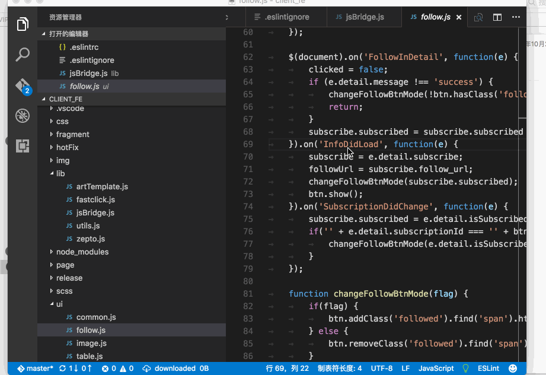
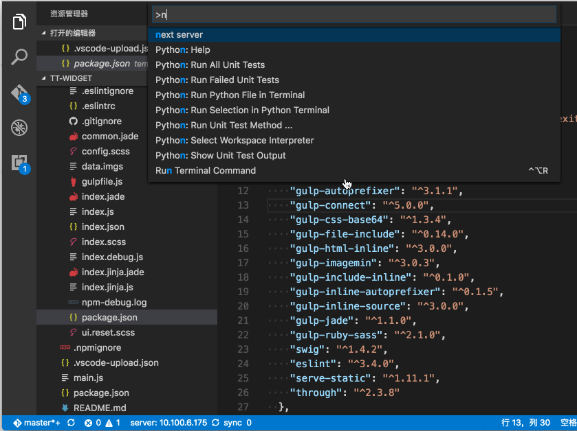

# upload

upload or download files from remote server via ssh2 and sftp
> localPath is not useful now, it's set to workspace root path in code;

Just simple set some config, upload file to server, get rid of vim or emacs;

## usage

### upload file or directory and download file



> not support download directory, it fouces on uploading to remote server, 
compensate for your difficulty on vim or emacs;

### switch sever



### setting
First, set config in `.vscode-upload.json` in your workspace

> I have removed localpath config item, local path is your workspace default, not confused to set different local config

### how to use

* `ctrl + s` will trigger upload

* right click to select upload to server;

* right click in explorer to upload directory or file to server;

* `cmd+shift+p` input upload command to upload file to remote server;

* `cmd+shift+p` input download command to download file to local;

* `cmd+shift+p` input readdir command to see dirtory;

* `cmd+shift+p` input next server command to switch server, need setting;

## Settings

* host: the address of remote server;
* port: the port of ssh2 server, default 22;
* username: your user name
* password: your password
* remotePath: the absolute path of your project in remote server;
* disable: setting true will stop uploading when ctrl+s, default false;
* private_Key: private key path to authenriate;

> localPath is not useful now, it's set to workspace root path in code;

For example:

```
{
    "host": "10.100.6.175",
    "port": 22,
    "username": "wuwei",
    "password": "WuWei.****",
    "remotePath": "/data04/wuwei/repos/i18n_web",
    "disable": false
}
```
or
```
[{
    "host": "10.1.6.175",
    "port": 22,
    "username": "****",
    "password": ********",
    "remotePath": "/data04/****/repos/i18n_web",
    "disable": false
},{
    "host": "10.1.6.188",
    "port": 22,
    "username": "****",
    "password": "*******",
    "remotePath": "/data04/****/repos/i18n_web",
    "disable": false
}]
```
for multi-server to switch

## Requirements

node: v6.6.0

npm: 3.10.3

only support sftp via ssh2

## Known Issues

## Release Notes

* 0.0.2 change vscode verion.
* 0.0.6 reuse connection, much more fast.
* 0.0.7 add filesize uploaded show, connect again when config file changed.
* 0.0.8 change readme and some code fix.
* 0.0.9 create config file auto in workspace.
* 0.1.0 fix some status show.
* 0.1.1 add upload dir to remote, add right click menu in explorer.
* 0.1.2 upload readme and multi-server support and server switch.
* 0.1.3 add private key authenriate.
### For more information

* [Visual Studio Code's Markdown Support](http://code.visualstudio.com/docs/languages/markdown)
* [Markdown Syntax Reference](https://help.github.com/articles/markdown-basics/)

